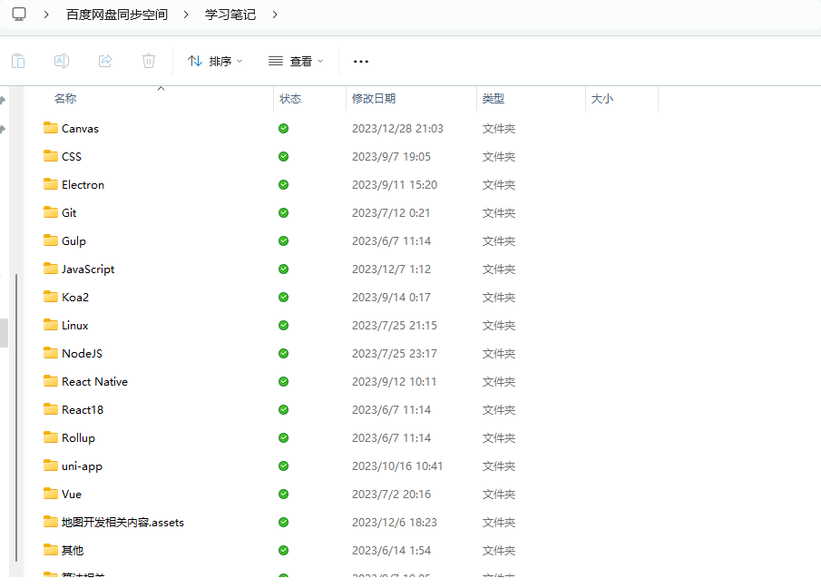
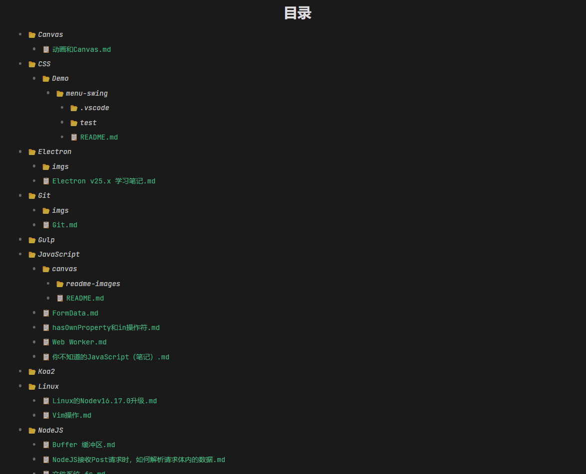

# get_markdown_catalog
一个可以直接获取指定路径下，所有Markdown文件目录的小工具。


## 运行
> 注意！运行前务必要修改`目标目录路径`，改为你自己笔记目录。
### 方法一（仅支持Windows系统）

直接双击`run.bat`文件运行脚本即可。


### 方法二

本项目未使用任何第三方依赖，无需安装第三方依赖，直接运行即可。

```shell
npm run dev
```


## 修改配置

在`index.js`中，可以进行配置修改

| 配置                   | 描述                                                         |
| ----------------------  | ------------------------------------------------------------ |
| targetPath             | 必填。目标目录路径，例如为`E:\\BaiduSyncdisk\\学习笔记`、`./markdown` |
| extname                | 需要遍历的文件后缀（即文件类型），默认为`['.md']`,请以`.`开头 |
| outputFileName         | 目录输入的最终文件名，默认为`目录.md`                        |
| showExtname            | 输入的内容，文件名是否要显示后缀，默认为`true`               |
| showExtname            | 输入的内容，文件名是否要显示后缀，默认为`true`               |
| ignoreDirectoryPattern | 需要忽略的文件夹名称，正则表达式                             |


## 效果

```js
require('./utils').getCatalogFile({
  targetPath: 'E:\\BaiduSyncdisk\\学习笔记',
  extname: ['.md', '.txt'],
  outputFileName: '目录.md',
  showExtname: true,
  ignoreDirectoryPattern: /\.assets$/
})
```





